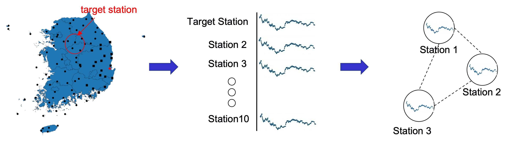
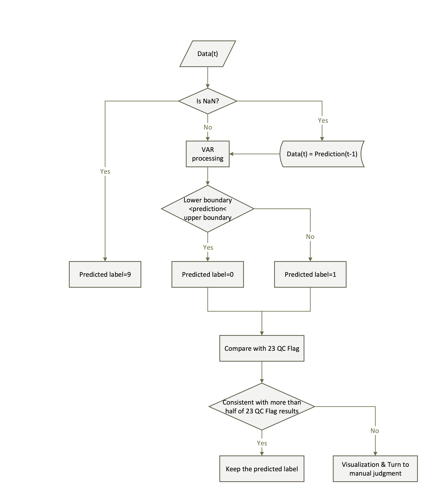
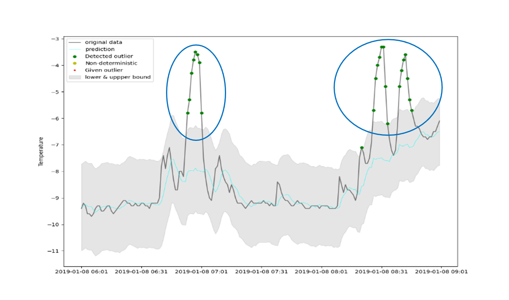
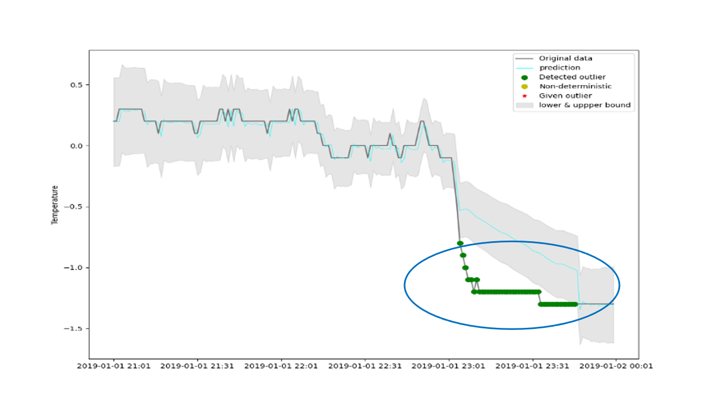

<p align="center">
  
</p>
<p align="center">
In applications such as weather forecasting and the prevention of natural disasters, the analysis of meteorological data is critical. In this work, given a large amount of continuous meteorological data from neighbouring regions, we transform the data analysis into an anomaly detection task. We utilize past data from neighbouring sites to predict the target site's current weather data, and then a framework is constructed for analysis and locating the outliers. 
</p>


# Overview

<p align="center">
  
</p>

The base prediction model is adpapted from vector autoregression (VAR) model which consider about the correlation of multiple viariant. For our task, the variants are data from nearby stations. As shown in above figure,  as the window sliding, if the data of target station is out of the range of the threshold, it would be considered as abnomal data, otherwise as the normal data.


<p align="center">
  
</p>

The overall flowchart of our meteorological data anomaly detection system. First determine whether the current data is empty, if it is empty, it will be supplemented with the data of the previous moment. If it is not empty, the data is sent to the VAR model, and then the current predicted value is obtained. If the current given value is within the predicted range, it is classified to be normal (predicted label=0). If it is not within the range, It is classified as abnormal (predicted label=1). In addition, our system will also refer to other detection indicators (QC Flag), the purpose is to comprehensively analysize the data of each sensor to make the results more accurate. If the comprehensive predicted results are consistent with the predicted results, the predicted results will be retained. If they are inconsistent, they will be automatically visualized. The current data is then handed over to manual inspection.


# Anomaly Detection Results Visualization
<p align="center">
  
</p>

<p align="center">
  
</p>


# Acknowlegements
This research work is supported by the National Institute of Meteorological Sciences.
<!-- 
# Citation
```
@article{chen2022unsupervised,
  title={Unsupervised domain adaptation based COVID-19 CT infection segmentation network},
  author={Chen, Han and Jiang, Yifan and Loew, Murray and Ko, Hanseok},
  journal={Applied Intelligence},
  volume={52},
  number={6},
  pages={6340--6353},
  year={2022},
  publisher={Springer}
}
``` -->
