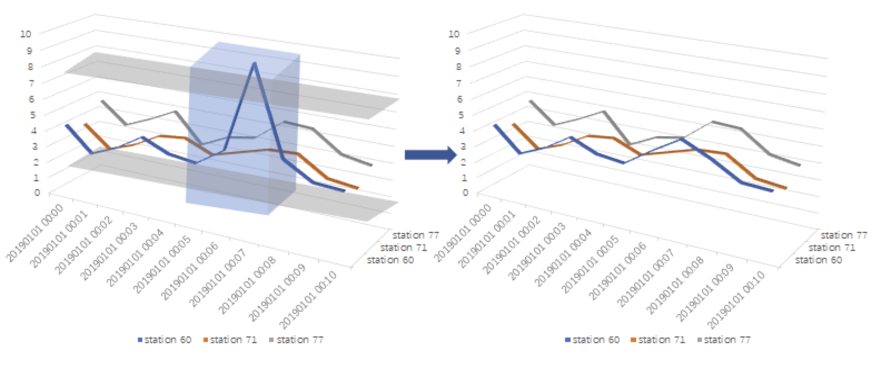

<p align="center">
  
</p>
<p align="center">
In applications such as weather forecasting and the prevention of natural disasters, the analysis of meteorological data is critical. In this work, given a large amount of continuous meteorological data from neighbouring regions, we transform the data analysis into an anomaly detection task. We utilize past data from neighbouring sites to predict the target site's current weather data, and then a framework is constructed for analysis and locating the outliers. 
</p>


# Overview

<p align="center">
  
</p>
<p align="center">
The base prediction model is adpapted from vector autoregression (VAR) model which consider about the correlation of multiple viariant. For our task, the variants are data from nearby stations. As shown in above figure,  as the window sliding, if the data of target station is out of the range of the threshold, it would be considered as abnomal data, otherwise as the normal data.
</p>


<p align="center">
  
</p>
<p align="center">
In applications such as weather forecasting and the prevention of natural disasters, the analysis of meteorological data is critical. In this work, given a large amount of continuous meteorological data from neighbouring regions, we transform the data analysis into an anomaly detection task. We utilize past data from neighbouring sites to predict the target site's current weather data, and then a framework is constructed for analysis and locating the outliers. 
</p>


# COVID-19 CT Infection Segmentation Results
<p align="center">
  
</p>
<p align="center">
Qualitative results for two-class segmentation task. Columns 1 and 2 present the input real COVID-19 CT images and corresponding ground truth, while Column 6 is the segmentation result of our proposed method. The first to last rows are the results when taking ground-glass opacity (a), consolidation (b), infection (c) and the lung (d) as the segmentation object, respectively.
</p>

<p align="center">
  
</p>
<p align="center">
Qualitative results for multi-class segmentation task. Columns 1 and 2 show the input real COVID-19 CT images and corresponding ground truth, in which the ground-glass opacity is marked in blue, consolidation is marked in green, and the lung is marked in red. Columns 7 is the segmentation result for our proposed method.
</p>

# Acknowlegements
This research work is supported by the Air Force Office of Scientific Research (award number FA2386-19-1-4001).

# Citation
```
@article{chen2022unsupervised,
  title={Unsupervised domain adaptation based COVID-19 CT infection segmentation network},
  author={Chen, Han and Jiang, Yifan and Loew, Murray and Ko, Hanseok},
  journal={Applied Intelligence},
  volume={52},
  number={6},
  pages={6340--6353},
  year={2022},
  publisher={Springer}
}
```
